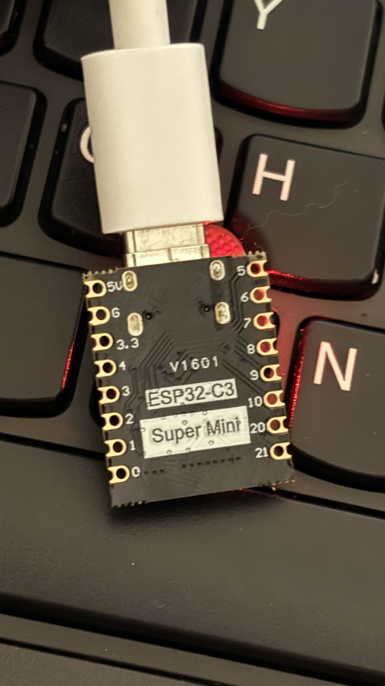
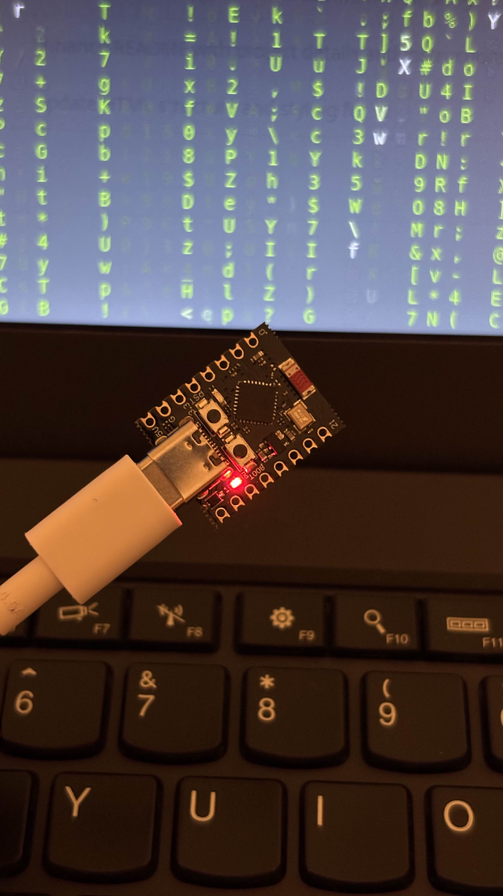

# 🚀 Agneesjs Deck
DIY Stream Deck sterowany przez Bluetooth z iPhone'a (Bluefy).

## 📁 Struktura
- `index.html` - Panel sterowania (GitHub Pages).
- `arduino/` - Kod dla ESP32.
- `python/` - Skrypt odbiorczy dla Linux Mint XFCE.

## ⚙️ Instalacja
1. Wgraj kod z folderu `arduino/` na płytkę ESP32.
2. Na laptopie zainstaluj: `pip install pyserial --break-system-packages`.
3. Uruchom skrypt: `python3 python/deck_listener.py --break-system-packages`.
4. Otwórz stronę projektu w Bluefy i połącz się z **Agneesjs_Deck**.

## ⌨️ Funkcje
- **Matrix ON/OFF** - Zielony deszcz znaków.
- **Lock** - Szybka blokada ekranu.

## 📸 Galeria

  
  
  
<i>Mój mikrokontroler ESP32-C3 SuperMini</i>

### Sprzęt:
1. **Mikrokontroler:** ESP32-C3 SuperMini (RISC-V).
2. **Kabel USB-C:** Do połączenia z laptopem i przesyłu danych.
3. **iPhone:** Z aplikacją Bluefy.
4. **Laptop:** Linux Mint XFCE.
